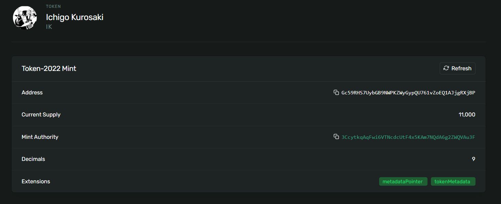

# Token Mint - Devnet Demo

## Minted Token details
**Token Address**: `Gc59RHS7UybGB9NWPKZWyGypQU761vZoEQ1AJjgRXjBP`



[View in Solana Explorer](https://explorer.solana.com/address/Gc59RHS7UybGB9NWPKZWyGypQU761vZoEQ1AJjgRXjBP?cluster=devnet)
## Setup

```bash
git clone https://github.com/subhadeep-sengupta/token-mint
cd token-mint
bun install
```

## Usage
1. **Import your wallet**
   - Place your wallet keypair JSON in the project directory and configure as needed.

2. **Change the token metadata**
   - Update the metadata fields before minting, if desired.

**Mint tokens**

```bash
bun run mint-tokens
```
